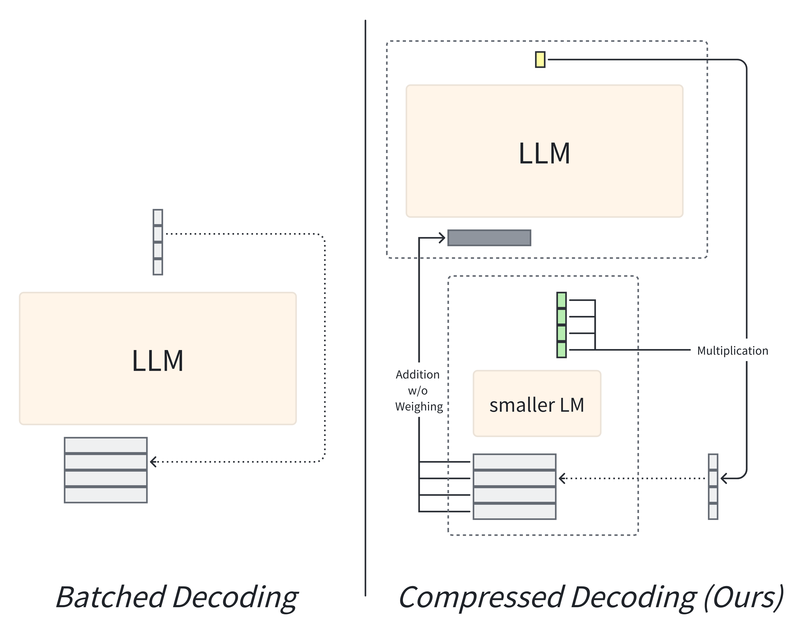
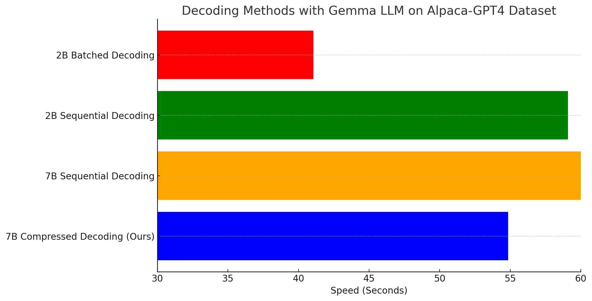

# Compressed Decoding

**Compressed Decoding**: decoding multiple tokens from an LLM for multiple samples at the same time



## Installation

Python 3.10 is recommended. You can install the required packages by running the following command:

```bash
pip install -r requirements.txt
```

## Quick Start

To experiment it with alpaca-gpt4 dataset, you can run the following command:

```python
bash para_decode_alpaca_gpt4_prefiltering.sh
```

To use it with your own dataset, please modify the `data_path` and `data_filename` arguments in the script. `data_path` is the path to the directory containing the dataset, and `data_filename` is the name of the dataset file. The dataset should be in the `json` format of a list of dictionaries, where each dictionary contains the following keys:

- `instruction`: `str`
- `input`: `str`

## Preliminary Results

The following table shows the preliminary results of the time used in decoding 60 samples from the alpaca-gpt4 dataset with the batch size of `3` on Gemma-7B. The decoding time is measured in seconds. Through human evaluation, we found that the decoding results are similar to Gemma-7B's greedy decoding results.

It is worth noting that our experiment is performed on a single NVIDIA A100-PCIE-40GB GPU, on which Batched Decoding on 7B LLMs is not possible due to the memory limitation.



Try it out with different hyper-parameters (e.g., batch size, etc.) and let us know your thoughts!

## Prospects

The method is orthogonal to [**lookahead decoding**](https://github.com/hao-ai-lab/LookaheadDecoding?tab=readme-ov-file) and could be used together with **batched decoding**, which is a promising direction for future work.
